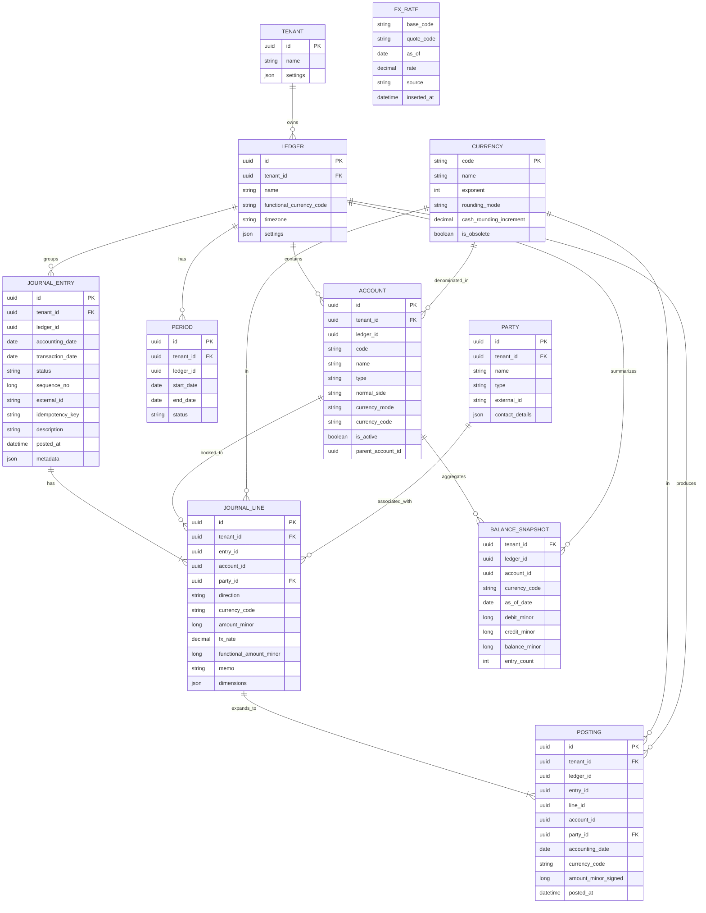

## General-Purpose Double-Entry, Multi-Currency Ledger – Design

### Goals
- **Double-entry**: Every journal entry nets to zero on the functional currency, with clear debit/credit semantics.
- **Multi-currency**: Support account and line currencies, FX rates, revaluation, realized/unrealized gains/losses.
- **Auditability**: Append-only postings, immutable posted entries, period locks, full traceability.
- **Performance**: Event-style `POSTING` rows and incremental `BALANCE_SNAPSHOT` for fast reads.
- **Extensibility**: Dimensions/tags, hierarchical COA, multiple ledgers/tenants, idempotent APIs.

### Core Concepts
- **Ledger**: Tenant-scoped book of record with a single functional currency and timezone.
- **Chart of Accounts (COA)**: Accounts with type and normal side, optional hierarchy, optional currency constraint.
- **Party**: An external entity (e.g., customer, vendor, employee) involved in a transaction.
- **Journal Entry**: User/API submitted document composed of lines. When posted, expands to atomic `POSTING`s.
- **Posting**: Immutable atomic effect on one account in one currency on a date.
- **Balance Snapshot**: Pre-aggregated balance per account and currency as of a date for read performance.

### ERD

### Data Model Details
- **Ledger**
  - `functional_currency_code`: Required base currency for balancing and reporting.
  - `settings`: JSON for policies (e.g., revaluation method, rounding, default FX source).
- **Tenant**
  - Multi-tenant boundary. All main tables include `tenant_id` for isolation and indexing.
- **Account**
  - `type`: ASSET | LIABILITY | EQUITY | REVENUE | EXPENSE | CONTRA.
  - `normal_side`: DEBIT | CREDIT (e.g., ASSET→DEBIT, REVENUE→CREDIT).
  - `currency_mode`: SINGLE | MULTI. If SINGLE, enforce line currency equals `currency_code`.
  - `parent_account_id`: For hierarchical COA and roll-ups.
- **Period**
  - `status`: OPEN | CLOSED | LOCKED. Posting allowed only in OPEN.
- **Party**
  - `type`: CUSTOMER | VENDOR | EMPLOYEE | OTHER. Defines the relationship for reporting.
  - `external_id`: Optional ID from an external system (e.g., CRM, payroll).
  - `contact_details`: JSON for address, phone, etc.
- **Journal Entry**
  - `status`: DRAFT | POSTED | REVERSED | VOID. Immutable after POSTED.
  - `sequence_no`: Monotonic per ledger, assigned at post time.
  - `idempotency_key`: Uniqueness per ledger for create/post APIs.
- **Journal Line**
  - `direction`: DEBIT | CREDIT.
  - `amount_minor`: Minor units of line currency (int64).
  - `fx_rate`: Transaction→functional rate used; stored for audit.
  - `functional_amount_minor`: Rounded minor units after applying `fx_rate`.
  - `dimensions`: Optional JSON for tags (cost center, product, region, service_id, etc.).
- **Posting**
  - `amount_minor_signed`: Positive for DEBIT, negative for CREDIT, in the line currency.
  - One posting per line; optional expansion for tax/allocations happens before posting.

### Journal Line: Direction vs Debit/Credit Columns
- Recommended shape for `JOURNAL_LINE`:
  - Use `direction` (DEBIT|CREDIT) plus a single non-negative `amount_minor` in the line currency.
  - Advantages: simpler validation (no both-sides populated), easier invariants (amount ≥ 1), clear intent, UI-friendly.
- Recommended shape for `POSTING` (event rows):
  - Use a single signed `amount_minor_signed` where debit = positive and credit = negative. This makes aggregation and running balances efficient.
- Alternative API shape (if preferred):
  - Accept `debit_minor` and `credit_minor` on the write API; validate exactly one is set; internally convert to `direction` + `amount_minor`.

### Posting and Validation Rules
- **Balancing**
  - Sum(functional `functional_amount_minor` debits) = Sum(functional credits) = 0 net per `JOURNAL_ENTRY`.
  - If all lines share the same non-functional currency and policy requires, optionally validate foreign-currency balance too.
- **Account constraints**
  - If account `currency_mode` = SINGLE, enforce line `currency_code` = account `currency_code`.
  - Validate account is `is_active` and not in a CLOSED/LOCKED period.
- **Rounding**
  - Round per `CURRENCY.exponent` and `rounding_mode`. Any residual difference posted to a configured rounding account.
- **Sequence and immutability**
  - Assign `sequence_no` on post; prohibit edits to posted lines; allow formal reversals only.

### Account Balances and Normal Side
- Each account has a `normal_side` (DEBIT for Assets/Expenses, CREDIT for Liabilities/Equity/Revenue by default).
- Balance in account currency:
  - If `normal_side = DEBIT`: `balance_minor = SUM(max(amount_signed, 0)) - ABS(SUM(min(amount_signed, 0)))`.
  - If `normal_side = CREDIT`: `balance_minor = ABS(SUM(min(amount_signed, 0))) - SUM(max(amount_signed, 0))`.
- Equivalent aggregation using separate totals:
  - `debit_minor = SUM(CASE WHEN amount_signed > 0 THEN amount_signed ELSE 0 END)`
  - `credit_minor = ABS(SUM(CASE WHEN amount_signed < 0 THEN amount_signed ELSE 0 END))`
  - If `normal_side=DEBIT`: `balance = debit_minor - credit_minor`; else `balance = credit_minor - debit_minor`.

### FX and Multi-Currency Handling
- **Rates**
  - Prefer direct pair (line currency → functional). If unavailable, triangulate via a configured base (e.g., USD or functional) with consistent rounding.
  - `FX_RATE.as_of` selection: by `transaction_date` or `accounting_date` per policy; store source and rate used on each line.
- **Functional amounts**
  - `functional_amount_minor` = round(`amount_minor` × `fx_rate`).
  - Entry must balance on functional amounts.
- **Realized/Unrealized**
  - Realized gains/losses recognized when monetary items are settled (e.g., AR/AP payment). Compute difference between historical and settlement functional amounts; post to FX gain/loss accounts.
  - Period-end revaluation for monetary balances: create reversing entries at next period open.

### Period Management
- Periods cannot overlap. Only one OPEN period at a time per ledger unless policy allows back-posting.
- Closing process:
  - Lock period, run revaluation and accruals, post closing entries (e.g., income → retained earnings), then set to CLOSED.
- Reversals:
  - Two types: full reversal (mirror entry on a chosen date) and void (if never posted to balances or within same batch pre-close).

### API Surface (HTTP or gRPC)
- Accounts
  - POST `/ledgers/{ledgerId}/accounts` create
  - GET `/ledgers/{ledgerId}/accounts` list/filter
  - PATCH `/accounts/{accountId}` update (name, active)
- Journal Entries
  - POST `/ledgers/{ledgerId}/journal-entries?post=true` create+post with `idempotency-key`
  - POST `/journal-entries/{id}/post` post draft
  - POST `/journal-entries/{id}/reverse` reverse on date
  - GET `/journal-entries` query by date, status, external_id
- FX Rates
  - POST `/fx/rates` upsert
  - GET `/fx/rates?base=EUR&quote=USD&as_of=2025-03-10`
- Periods
  - POST `/ledgers/{ledgerId}/periods` open
  - POST `/periods/{id}/close` close & lock
- Balances & Reports
  - GET `/balances/trial?as_of=...`
  - GET `/accounts/{id}/statement?from=...&to=...`
  - GET `/balances/snapshots?date=...`

### Reporting
- **Trial balance**: Aggregate `POSTING` or `BALANCE_SNAPSHOT` by account, by currency and functional.
- **Account statement**: Chronological postings with running balance.
- **Aged AR/AP**: Use dimensions and counterparties; aging buckets.
- **Multi-currency**: Show native currency balances and translated functional amounts with disclosed rates.

### Indexing and Storage Strategy (for PostgreSQL)
- Partition or cluster by `ledger_id`.
- Indexes:
  - Prefix all main indexes with `tenant_id`.
  - `POSTING(tenant_id, ledger_id, account_id, currency_code, accounting_date)`
  - `JOURNAL_ENTRY(tenant_id, ledger_id, accounting_date, status)`
  - `JOURNAL_ENTRY(tenant_id, ledger_id, idempotency_key)` UNIQUE
  - `ACCOUNT(tenant_id, ledger_id, code)` UNIQUE
  - `FX_RATE(base_code, quote_code, as_of)` UNIQUE
- Consider table partitioning by month/quarter for `POSTING` on large ledgers.

### Multi-Tenancy
- Add `tenant_id` to all main tables; `LEDGER.tenant_id` is required and all child rows inherit the same `tenant_id`.
- Enforce composite uniqueness with `tenant_id` to avoid cross-tenant collisions.
- Apply Row-Level Security (RLS) in PostgreSQL using a session variable/JWT claim `app.tenant_id`.
- Ensure all queries include `tenant_id` predicate, and all foreign keys include `(tenant_id, parent_id)` pairs where applicable.

### Concurrency and Idempotency
- Require `Idempotency-Key` header for create/post; deduplicate per ledger.
- Use optimistic concurrency on draft entries; assign `sequence_no` under transaction at post.

### Security and Audit
- Store `posted_at` and `posted_by` (user/service principal).
- Immutable posted entries; any change via reversal/new entry.
- Period LOCK prevents further postings unless override role.

### Example Posting (Purchase in EUR, functional USD)
Assume purchase expense of €100 at 1.10 USD/EUR on 2025-01-05, paid later.
- Lines on 2025-01-05:
  - DR `Expense:Supplies` €100 (fx 1.10 → $110)
  - CR `AP:EUR` €100 (fx 1.10 → $110)
- Payment on 2025-01-20 at 1.12 USD/EUR:
  - DR `AP:EUR` €100 (historical $110)
  - CR `Cash:Bank:EUR` €100 (current $112)
  - DR `FX Loss` $2 (realized)

### Non-Functional
- Deterministic rounding and FX source; time-zone aware `accounting_date`.
- Throughput via append-only `POSTING`, batched snapshot updates, async read models if needed.

### Implementation Notes (Spring Boot)
- Use `long` for minor units; `BigDecimal` for FX rate; validate exponents.
- Enforce rules in service layer with transactional boundaries; DB constraints mirror invariants.
- Provide migration scripts creating the above schema (Flyway/Liquibase).

